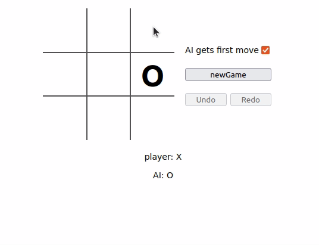

# Tic-tac-toe web app
with AI payer using minimax algorithm and time controll in form of `undo` and `redo` buttons  

developed based on the tic-tac-toe [react tutorial](https://reactjs.org/tutorial/tutorial.html) 

## Minimax algorithm
[algorithm](https://en.wikipedia.org/wiki/Minimax) used to **mini**mize **max**imum possible loss. In case of tic-tac-toe the algorithm can viably go through the entire game tree and select an optimal move.   The app has more of an educational purpose as the player cannot win against the opponent that uses this algorithm.

## Result 

